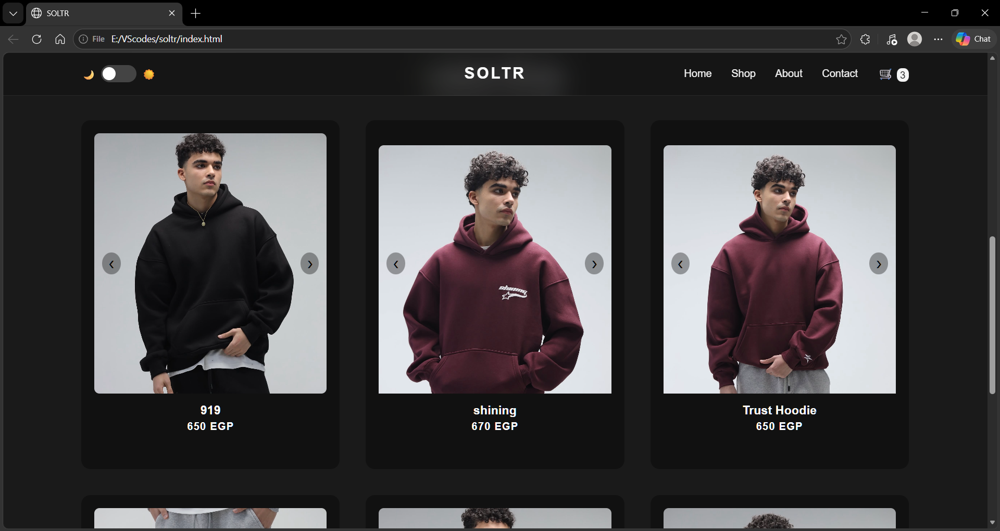

# 👕 Soltr Brand Website

A modern and stylish clothing brand website built as a frontend project.

## 📸 Preview

## 🚀 Features
- Responsive design (works on all devices)
- Clean and modern UI
- Product showcase section
- Smooth user experience
- Not Complete , only a little remains

## 🛠️ Technologies Used
- HTML5
- CSS3
- JavaScript

## 🌐 Live Demo
https://imazin99.github.io/soltr-brand-website

## 📂 Project Structure
index.html
style.css
script.js
/images

## 🎯 Purpose
This project was created to practice frontend development skills and build a modern brand website.

## 📌 Author
Mazen Ahmed  
Medical Informatics Student & Aspiring Full Stack Developer
